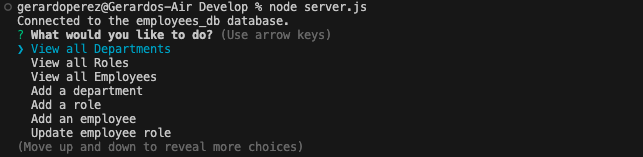

# Employee Tracker

## The Project

Developers frequently have to create interfaces that allow non-developers to easily view and interact with information stored in databases. These interfaces are called **content management systems (CMS)**. I am building a command-line application from scratch to manage a company's employee database, using Node.js, Inquirer, and MySQL.

## User Story

```md
AS A business owner
I WANT to be able to view and manage the departments, roles, and employees in my company
SO THAT I can organize and plan my business
```

## Acceptance Criteria

```md
GIVEN a command-line application that accepts user input
WHEN I start the application
THEN I am presented with the following options: view all departments, view all roles, view all employees, add a department, add a role, add an employee, and update an employee role
WHEN I choose to view all departments
THEN I am presented with a formatted table showing department names and department ids
WHEN I choose to view all roles
THEN I am presented with the job title, role id, the department that role belongs to, and the salary for that role
WHEN I choose to view all employees
THEN I am presented with a formatted table showing employee data, including employee ids, first names, last names, job titles, departments, salaries, and managers that the employees report to
WHEN I choose to add a department
THEN I am prompted to enter the name of the department and that department is added to the database
WHEN I choose to add a role
THEN I am prompted to enter the name, salary, and department for the role and that role is added to the database
WHEN I choose to add an employee
THEN I am prompted to enter the employee’s first name, last name, role, and manager, and that employee is added to the database
WHEN I choose to update an employee role
THEN I am prompted to select an employee to update and their new role and this information is updated in the database 
```

## Installation

Have the following packages: 

1. node.js
2. npm
3. Inquirer 8.2.4
4. dotenv 16.3.1
5. mysql2 3.6.0

## Notes

Updates: 
Feb 12, 2024: Will work on this project and fix the issues. 

Feb 26: Have completed the project. Fixed all of the errors and is fully functional. 

## Usage

The following images show the web application's appearance and functionality. 

Home screen: 

 

When you select View All Employees: 

 

## Links

[Repository](https://github.com/Gera1313/employee-tracker)

This walkthrough video is the old one before I fixed all of the bugs and errors, it is fully functional now:

[Walkthrough Video](https://youtu.be/MP4zhBCbCsM)

## License

[](https://opensource.org/licenses/MIT)